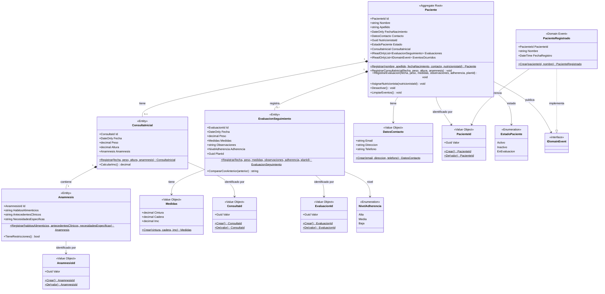

# NurTricenter — ms-pacientes-evaluacion

---

## Descripción del Microservicio

`ms-pacientes-evaluacion` es el microservicio responsable de gestionar el **registro, evaluación nutricional y seguimiento clínico de pacientes** dentro del sistema NurTricenter.

Cuando un nuevo paciente ingresa al sistema, este microservicio registra su información de contacto y lo asigna a un nutricionista. El nutricionista realiza una **Consulta Inicial** que incluye datos antropométricos (peso, altura, IMC) y una **Anamnesis** con hábitos alimenticios y antecedentes clínicos. A lo largo del tratamiento, el nutricionista registra **Evaluaciones de Seguimiento** periódicas que miden la evolución del paciente (peso, medidas, adherencia al plan). Los datos de adherencia y el estado de los pacientes activos alimentan al microservicio `ms-produccion-alimentos` para generar las órdenes de producción correspondientes.

### Endpoints disponibles

| Método | Ruta | Descripción |
|--------|------|-------------|
| `POST` | `/api/pacientes` | Registra un nuevo paciente con sus datos de contacto y nutricionista asignado |
| `GET` | `/api/pacientes` | Lista todos los pacientes con resumen de estado y evaluaciones |
| `GET` | `/api/pacientes/{id}` | Obtiene el detalle completo de un paciente por su Id |
| `POST` | `/api/pacientes/{id}/consulta-inicial` | Registra la consulta inicial con peso, altura y anamnesis |
| `POST` | `/api/pacientes/{id}/evaluaciones` | Agrega una evaluación de seguimiento con medidas y nivel de adherencia |
| `POST` | `/api/pacientes/{id}/asignar-nutricionista` | Reasigna el nutricionista responsable del paciente |
| `POST` | `/api/pacientes/{id}/desactivar` | Cambia el estado del paciente a `Inactivo` |

### Tecnologías y patrones

- **Domain-Driven Design (DDD):** Aggregate Root (`Paciente`), Entities (`ConsultaInicial`, `Anamnesis`, `EvaluacionSeguimiento`), Value Objects (`PacienteId`, `DatosContacto`, `Medidas`), Domain Events (`PacienteRegistrado`)
- **Clean Architecture:** capas Domain → Application → Infrastructure → Api, sin dependencias invertidas
- **CQRS con MediatR 14:** Commands para escritura (5 handlers), Queries para lectura (2 handlers), sin acoplamiento entre capas
- **Unit of Work:** una sola llamada a `IUnitOfWork.GuardarCambios()` por Command — todos los cambios en una transacción
- **Proyecciones directas a DTO:** los Query Handlers usan `IPacientesDbContext` con `.Select()` directo, sin materializar el agregado completo
- **Entity Framework Core 8** con SQL Server / LocalDB — `OwnsOne` anidado para `ConsultaInicial` + `Anamnesis`, `OwnsMany` en tabla separada para `EvaluacionSeguimiento`
- **Value Objects tipados** para IDs (`PacienteId`, `ConsultaId`, `EvaluacionId`, `AnamnesisId`) con validación en construcción

---

## Cómo ejecutar

### Requisitos

- [.NET 8 SDK](https://dotnet.microsoft.com/download/dotnet/8)
- SQL Server LocalDB (incluido con Visual Studio) o SQL Server Express

### Aplicar migraciones (crea la base de datos `NurTricenterPacientes`)

```bash
dotnet ef database update --project MsPacientesEvaluacion.Infrastructure --startup-project MsPacientesEvaluacion.Api
```

### Correr la API

```bash
dotnet run --project MsPacientesEvaluacion.Api
```

La API quedará disponible en `http://localhost:5144` y Swagger UI en `http://localhost:5144/swagger`.

---

## Diagrama de Clases



---

## Decisiones de Diseño

### Constructores privados + factory methods

Todos los agregados y entidades tienen el constructor público bloqueado. El único camino para crear una instancia válida es a través del factory method estático (`Paciente.Registrar(...)`, `ConsultaInicial.Registrar(...)`, etc.), que aplica todas las validaciones antes de construir el objeto. Un constructor privado adicional sin parámetros — con `= null!` en las propiedades de referencia — permite que EF Core materialice entidades desde la base de datos sin comprometer las invariantes del dominio.

### Colecciones expuestas como `IReadOnlyList<T>`

`Paciente` mantiene `_evaluaciones` como `List<EvaluacionSeguimiento>` privada y la expone como `IReadOnlyList<EvaluacionSeguimiento>` mediante `.AsReadOnly()`. Toda adición pasa obligatoriamente por `RegistrarEvaluacion()`, donde viven las reglas de negocio. Nadie puede hacer `paciente.Evaluaciones.Add(...)` desde fuera. EF Core accede al backing field directamente mediante `HasField("_evaluaciones").UsePropertyAccessMode(Field)`.

### Unit of Work — una transacción por Command

Los repositorios (`IPacienteRepository`) no exponen `GuardarCambios()`. El Command Handler es el responsable de llamar a `IUnitOfWork.GuardarCambios()` al final, cuando todas las operaciones del caso de uso están completas. Todos los repositorios y el `UnitOfWork` comparten la misma instancia de `PacientesDbContext` dentro del scope del request HTTP, por lo que un único `SaveChangesAsync()` confirma todos los cambios en una sola transacción SQL.

### Proyecciones directas a DTO en Queries

Los Query Handlers no pasan por `IPacienteRepository` — acceden a `IPacientesDbContext` directamente y usan `.Select()` antes de `ToListAsync()`. EF Core traduce la proyección a SQL: solo trae las columnas necesarias para el DTO, y expresiones como `p.ConsultaInicial != null` se traducen a `EXISTS(...)` en SQL. Esto evita cargar el grafo completo del agregado en memoria para operaciones de solo lectura.

### `ConsultaInicial` nullable en el aggregate

Un `Paciente` puede existir sin consulta inicial — es el estado inicial natural tras el registro. La propiedad `ConsultaInicial?` es nullable en el agregado y EF Core la mapea como columnas nullable en la tabla `Pacientes`. El método `RegistrarConsultaInicial()` valida que no exista una previa antes de asignarla, y cambia el estado del paciente a `EnEvaluacion` como efecto secundario del dominio.
