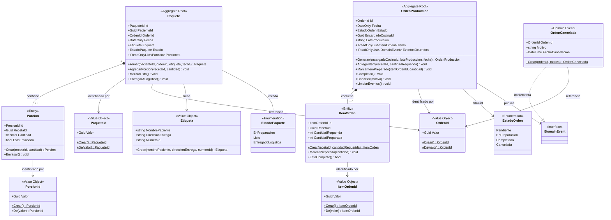

# NurTricenter — ms-produccion-alimentos

Capa de Dominio del microservicio `ms-produccion-alimentos`, implementada en C# (.NET 8) siguiendo **Domain-Driven Design (DDD)** y **Clean Architecture**.

---

## Diagrama de Clases

---

## Decisiones de Diseño

### IDs como Value Objects tipados

Cada agregado y entidad tiene su propio tipo de ID (`OrdenId`, `PaqueteId`, `ItemOrdenId`, `PorcionId`) en vez de usar `Guid` directamente. Esto previene errores de asignación cruzada que el compilador no detectaría con `Guid` plano — pasar un `PaqueteId` donde se espera un `OrdenId` es un error en tiempo de compilación, no en tiempo de ejecución. Todos siguen el mismo patrón: constructor privado, `Crear()` para instancias nuevas, `De(guid)` para reconstruir desde persistencia, con validación de `Guid.Empty` en ambos casos.

### Colecciones expuestas como `IReadOnlyList<T>`

Los agregados mantienen sus colecciones internas como `List<T>` privadas, pero las exponen públicamente como `IReadOnlyList<T>` mediante `.AsReadOnly()`. Esto garantiza que toda modificación pase obligatoriamente por los métodos del agregado (`AgregarItem`, `AgregarPorcion`), donde viven las reglas de negocio y las validaciones de estado. Nadie puede hacer `orden.Items.Add(...)` desde fuera y saltarse las invariantes del dominio.

### Domain Events mínimos

Se implementó un patrón de Domain Events sin bus de despacho, usando una interfaz marcador `IDomainEvent` y una lista interna en el agregado. Cuando `OrdenProduccion.Cancelar()` es invocado, publica un evento `OrdenCancelada` (con `OrdenId`, `Motivo` y `FechaCancelacion`) en su colección `EventosOcurridos`. La capa de Infrastructure es responsable de leer esos eventos después de persistir el agregado, despacharlos al bus correspondiente, y luego llamar a `LimpiarEventos()` para evitar reprocesamiento. El dominio no conoce ni depende del mecanismo de despacho — solo declara que algo ocurrió.
